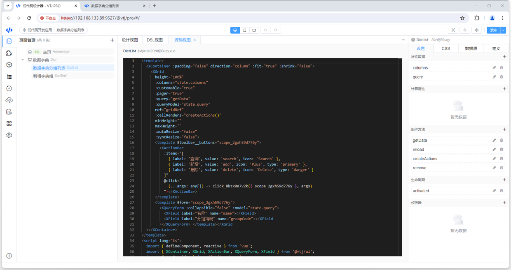
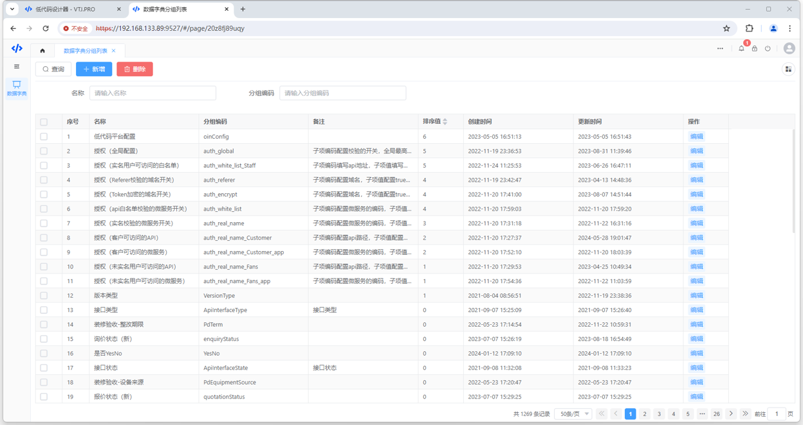
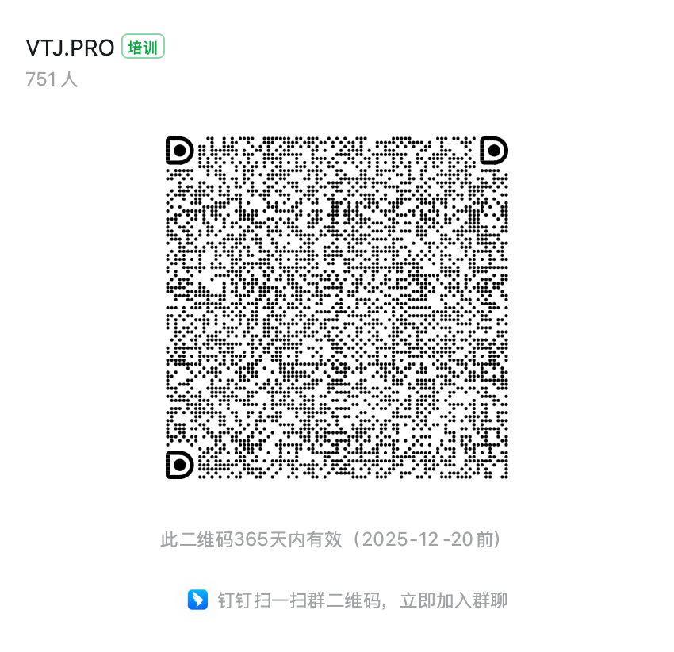

<div align="center"> <a href="https://gitee.com/newgateway/vtj">  </a> <br> <br>

[](https://gitee.com/newgateway/vtj)
[](https://www.npmjs.com/package/@vtj/pro)
[](https://npm-stat.com/charts.html?package=@vtj/pro)
[](LICENSE)

</div>

# VTJ.PRO

VTJ 一款基于 Vue3 + Typescript 的低代码页面可视化设计器。内置低代码引擎、渲染器和代码生成器，面向前端开发者，开箱即用。 无缝嵌入本地开发工程，不改变前端开发流程和编码习惯。

## 官网

- [https://vtj.pro](https://vtj.pro)

## VTJ 的特点

- 面向前端开发者，不改变前端开发流程和编码习惯，会 Vue 就会用，无学习成本。
- 内置代码引擎，采用配置化构建，所有部件都支持自定义，可单独使用引擎实现属于你自己的低代码平台，对标 Low-Code Engine。
- 开发环境提供本地离线服务，安全易接入，采用设计器和渲染器分离，不污染项目代码。
- 内置丰富组件提供支持，可定制可复用区块组件。






## 体验

### 在线体验

- [http://lcdp.vtj.pro](http://lcdp.vtj.pro)

访问Vtj专属低代码开发平台，创建应用可以体验设计器和出码功能

### 本地体验（推荐：功能更全， 性能最佳）

可以使用VTJ提供的项目脚手架，可快速创建体验项目。 命令：

```sh
npm create vtj@latest -- -t app
```

## 贡献指南

### 开发环境要求

VTJ 使用了最新的 Vue3 生态技术栈，要求 Node 版本必须是 v20+， 建议使用 nvm 切换 Node 版本。
开发项目工程采用`lerna` 和 `pnpm` 包管理工具，需要全局安装。

```sh
npm install -g lerna@latest pnpm@latest --registry=https://registry.npmmirror.com
```

如果需要二开或贡献代码，可以拉取仓库master分支。

### 快速开始

```sh
git clone https://gitee.com/newgateway/vtj.git
cd vtj
npm run setup && npm run build && npm run app:dev
```

- 首次启动需要执行初始化：`npm run setup && npm run build`
- 重启开发环境：`npm run app:dev`
- 清理项目：`npm run clean` 清理后需要重新执行初始化

## 技术交流

### 钉钉群



### 微信群


