# 创建一个低代码应用（ Todo ）

实现 如下图效果

todoList 分为三部分 头部的输入框, 中间主体的列表以及底部
### 页面的创建

创建完成后,效果如下：

页面分为四个模块。最左边的是应用配置栏；然后是页面管理，相当于 routes ; 中间最大那块区域就是设计视图区域，最右边的是页面的配置。

### 头部输入框的创建

输入框实现的功能是 输入值，按回车确认， 把值添加的列表中

在应用的配置栏中点击 `组件库`， 在 UI 中 拖动 `XContainer` 容器组件 到页面上，`XContainer`容器组件相当于一个的`div`,然后拖 `XField` 字段组件 到`XContainer`组件的里面，

拖动完成后，效果如下：

**在应用栏中 点击大纲树 查看 页面组件的结果**

如果看到是下面的结果, 可以直接在大纲树中拖 `XField` 组件 到 `XContainer容器组件` 上面，实现效果。

在 最右边的页面配置区域，操作属性配置，把展示效果呈现好看点。
XContainer 排列布局改完 纵向排列

XField 删除label, placeholder 修改

#### 头部功能实现
输入值，按回车确认， 把值添加的列表中。

##### 属性配置

回到页面管理应用中, 点击todoList 打开页面  点击页面内容或者 右上角的设置按钮，打开页面的`数据配置`

在 `状态数据` 中 设置 所需的 数据, `XField` 组件的输入值 `inputValue`, 默认值为 `''`, 列表数据 `list`, 默认值为 `[]`。

#### 数据双向绑定
输入值 inputValue 与 XField 组件 进行 双向绑定。

这里的操作实现 相当于实现了 v-model 的绑定。

#### 回车确认添加到列表中 
在 `todoList` 页面, 点击 `XField` 组件，在 组件的事件中 实现 回车确认添加到列表中 。 

### 列表组件

#### 创建组件

> 注意 记得回到 `todoList` 页面中 操作

创建组件的方式和头部区域的创建一样，拖拽组件库中的组件到 todoList 页面中

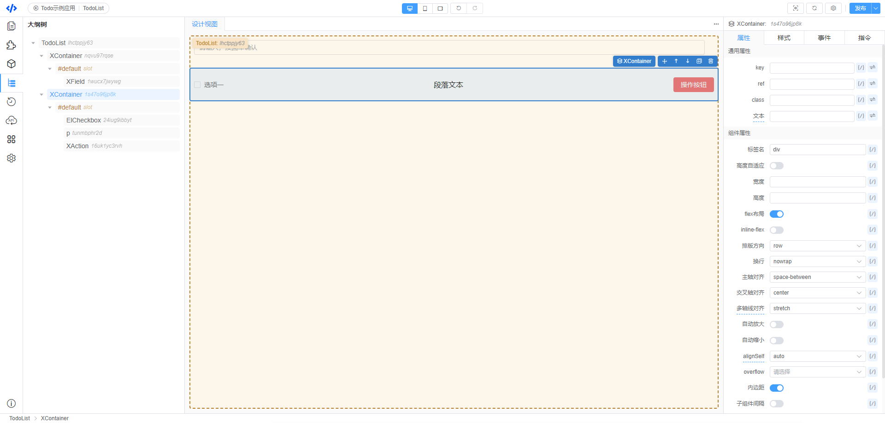

#### 遍历列表

在 列表的 `XContainer` 组件 中 循环遍历 `list` 列表
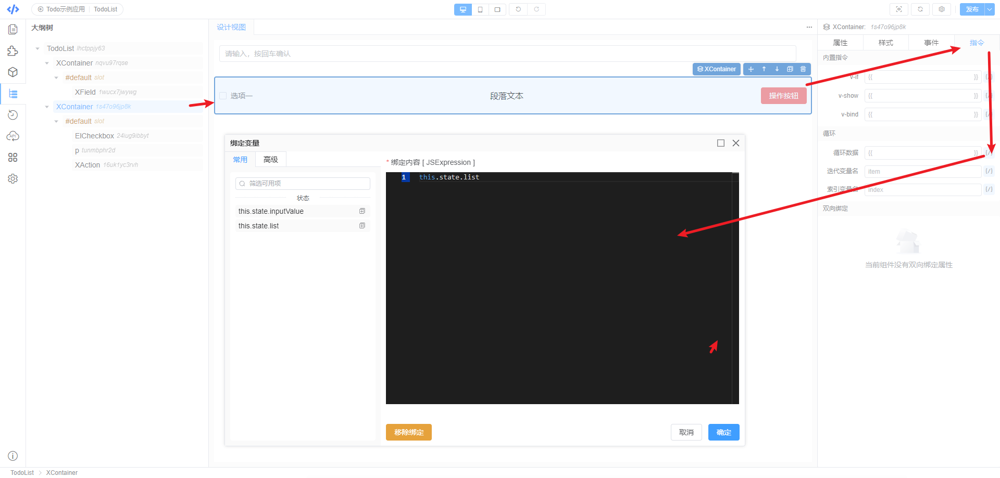

把 需要的数据绑定 到 `XContainer` 组件中

**因为在属性配置哪里设置了 list 的初始值 为空数组，可能看不到列表的展示，可以回到属性配置那里添加几条测试数据**
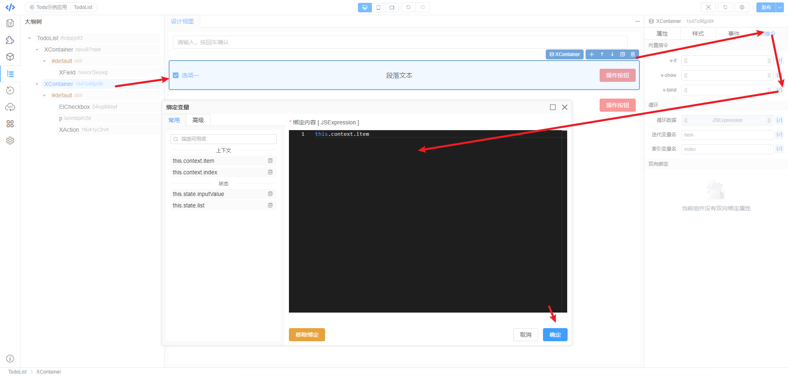

把 列表遍历中是 数据 item 绑定到 每一个 XContainer 容器组件中

#### key 值的绑定

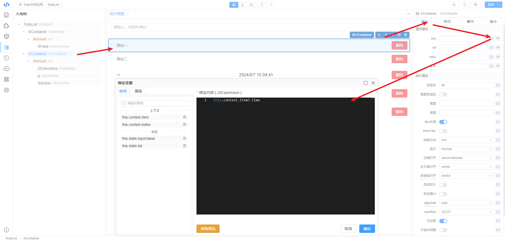

#### 遍历的数据绑定
 将 数据 item对象中的数据 与 组件属性的绑定。 所有的绑定操作都是一样的操作。 
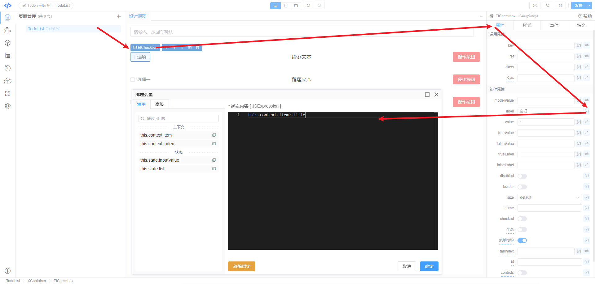
绑定后,效果如下：

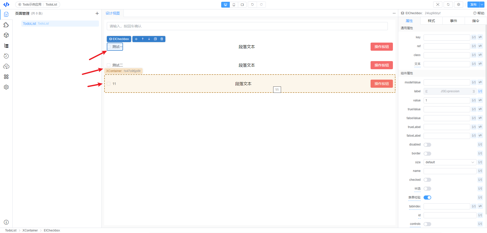

#### checkbox 的数据修改
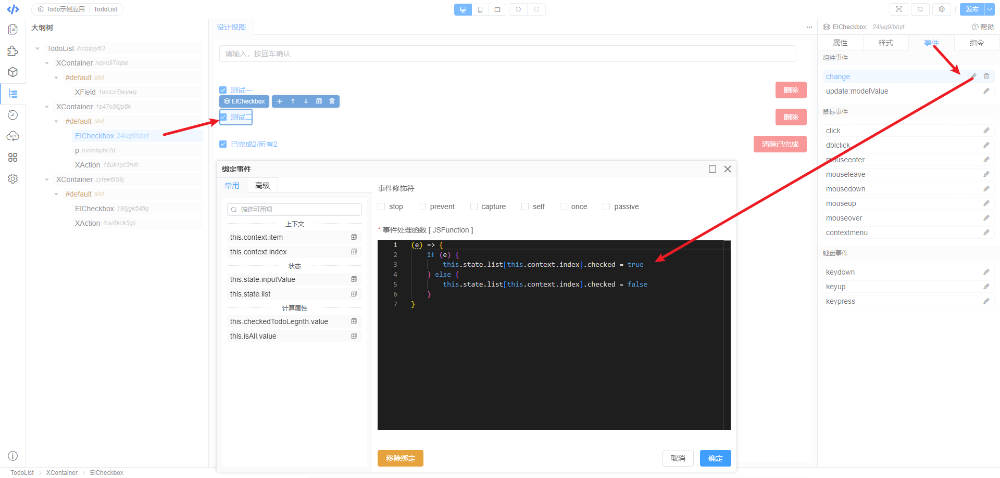

#### 初步效果查看

可以在 page页面中 查看效果了。

也可以在点击页面的预览按钮查看效果。
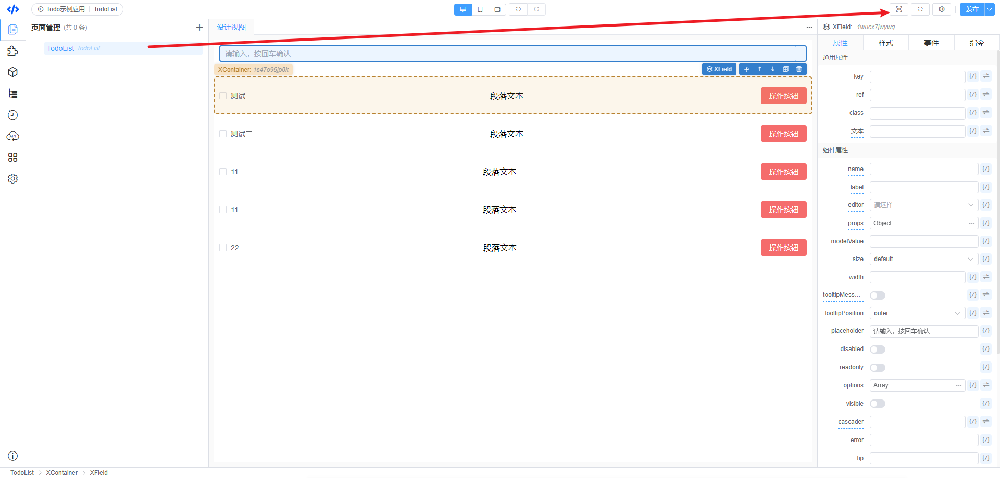

#### 列表项的删除

实现方式 和  头部功能实现 一样
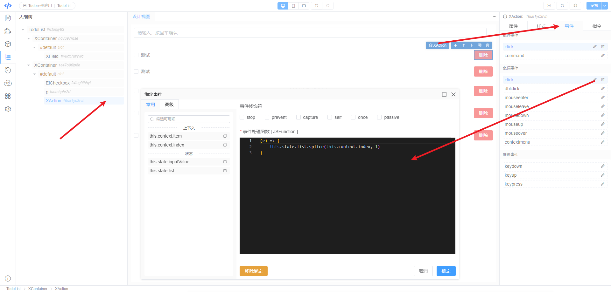

### 底部区域的实现

组件创建和之前一样

#### 实现清除已完成
在底部 `XContainer` 组件中 `XAction` 操作组件的事件中实现点击方法
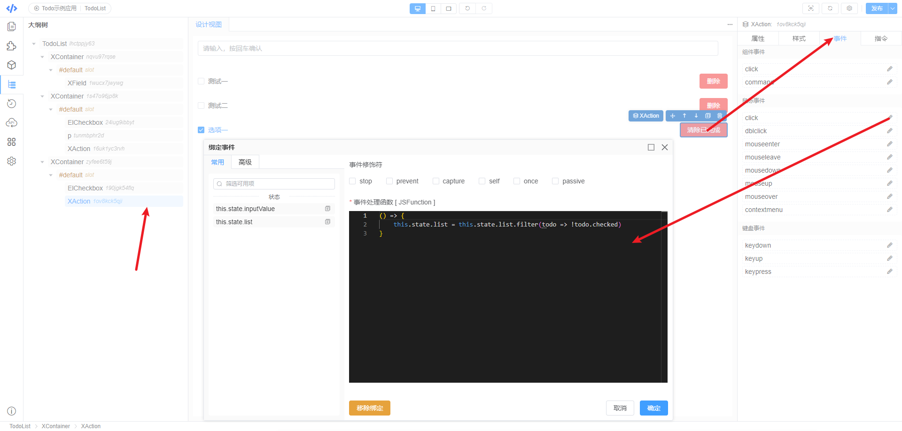

#### 实现全选

  1. 在 `todoList` 页面 的计算属性中 设置 已选todo 的数量
  
  2. 列表中 所有项 选择了 全选为true。在 todoList 页面 的计算属性中 设置 是否全选 
   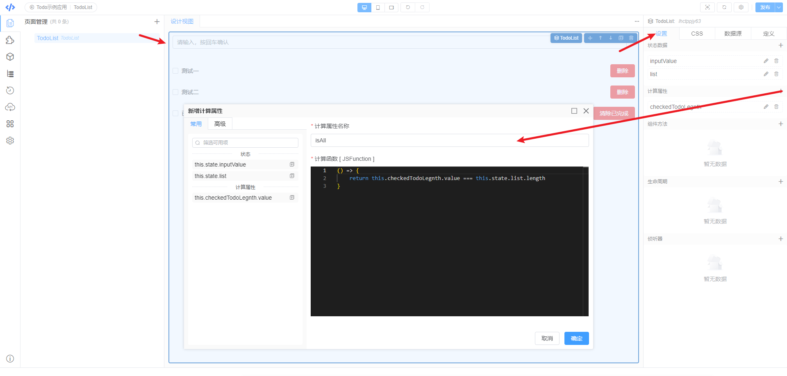
     - 将 `isAll` 计算属性 和 `checkbox的值` 进行双向绑定
         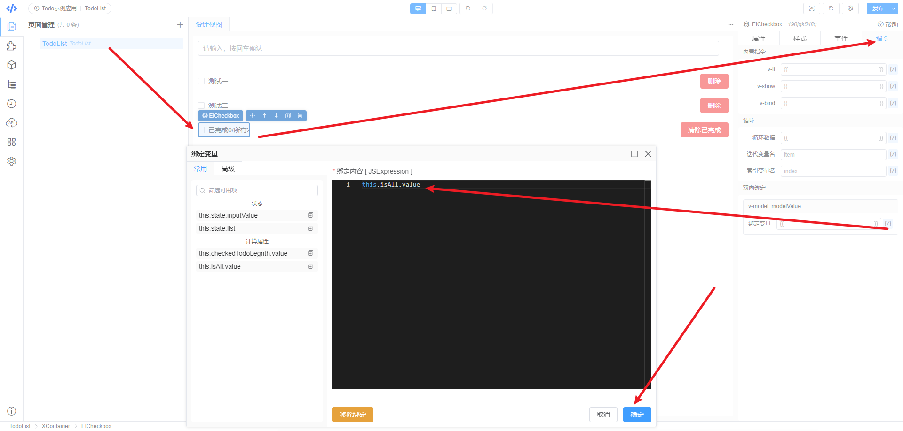
  3. `checkbox` 改变时 修改全选或非全选
 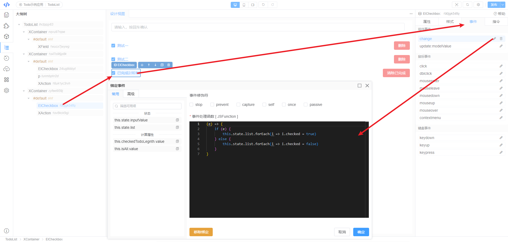

 #### 预览效果
>  查看效果
  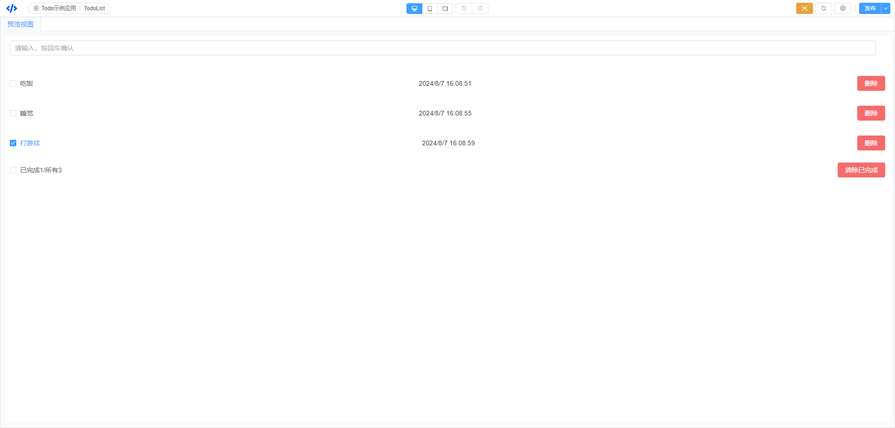