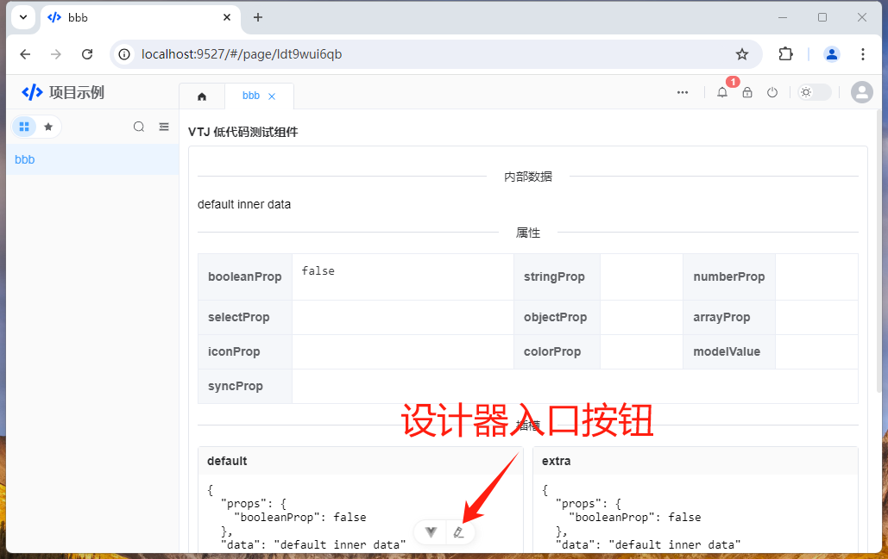

# VTJ低代码设计器入门系列（二）：可视化设计器功能概述

设计器的作用是把组件物料通过可视化的方式，按低代码的协议生成DSL文件。同时也能读取DSL文件渲染出网页效果。

## 入口链接

本地项目工程通过命令行 `npm run dev` 启动后，如为设置项目主页时，会显示项目启动页，如下：

可以通过点击 `开始设计` 按钮进入设计器

如已经已有主页，在页面左下角 或 底部将会出现设计器的入口按钮，如下：

或，如果开启了vue-devtools，将会出现下面的按钮

## 功能分区

低代码设计器采用骨架分区的方式构建，功能有以下区域， 没个区域下内置了响应的功能组件`Widget`

- **品牌区：** 包含品牌Logo、显示当前打开的项目和正在编辑组件，点击链接可返回当前页面组件的源码预览模式
- **工具区：** 模拟器视图切换、当前编辑文件的操作历史记录导航
- **操作区：** 文件预览、页面刷新、页面设置、发布
- **应用区：** 页面管理、区块管理、物料组件库、当前编辑的页面大纲树结构、当前文件编辑历史记录、API管理、数据配置管理、依赖管理、项目配置
- **工作区：** 当前文件的设计视图、DSL视图、源码视图、帮助文档、~~物料市场~~
- **设置区：** 页面设置（状态数据、计算属性、组件方法、生命周期、watch、css、数据源、组件定义），节点设置（属性、样式、事件、指令）
- **状态区：** 当前正在设置的节点信息、~~错误报告~~

## 操作步骤

功能的实现思路与手写代码开发方式一致。

1. 新建页面，如页面复杂，可拆分区块
1. 新增API、数据配置，如果是公共模块的API，如 core、file、meta、sys、search、user 等，可以在UI库内置。
1. 从组件库面板拖拽需要的组件到设计视图
1. 设置页面需要的状态、属性、方法、事件、生命周期、样式等
1. 给节点设置属性、绑定变量
1. 完成功能，预览、发布
