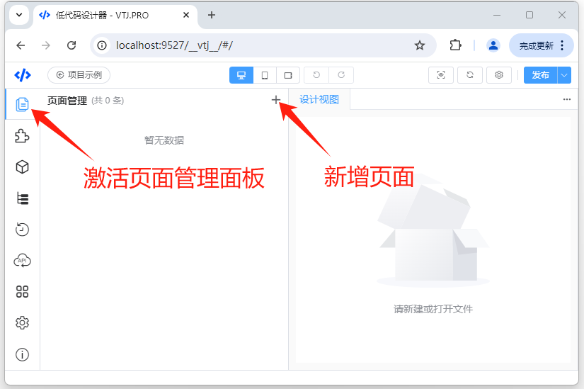
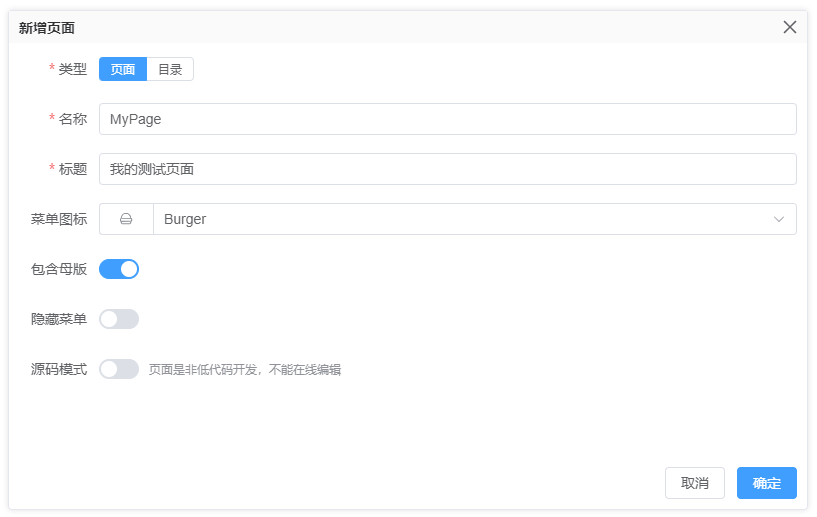
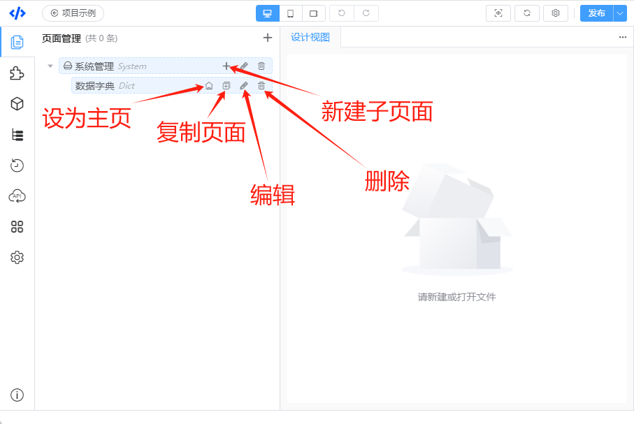
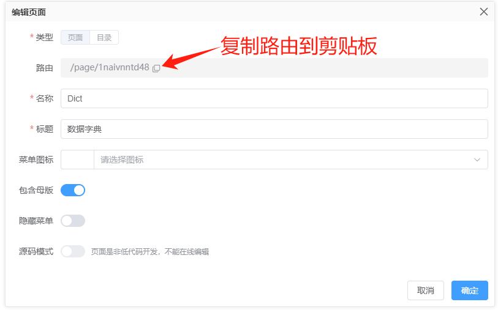
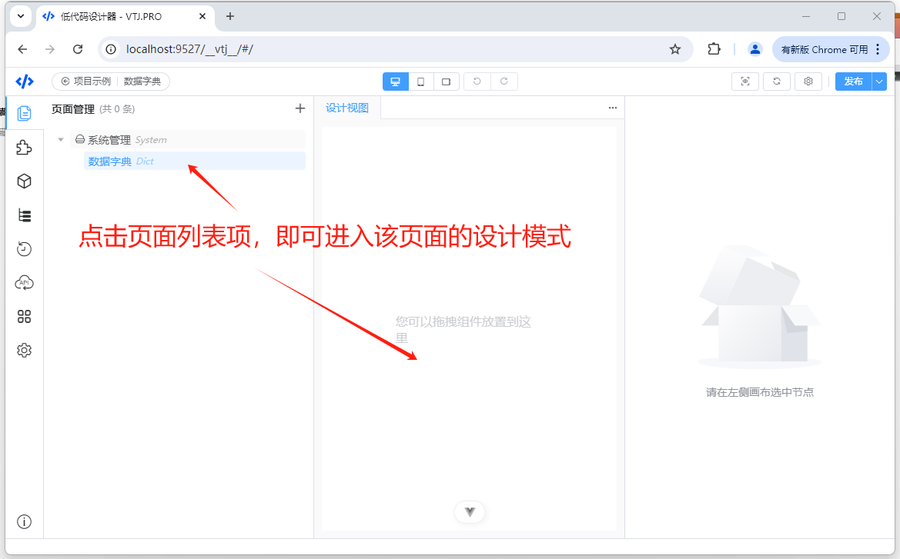

# VTJ低代码设计器入门系列（三）：页面管理

页面管理是VTJ.PRO低代码的基础功能。页面是指使用设计器创建的vue单文件组件，带有路由，发布后可通过路由 `/page/页面ID`的方式访问。
在设计器的页面管理模块，不仅可以创建页面，并且维护系统应用的菜单树。 下面我们简介页面管理的相关功能。

## 新建页面或目录

1. 打开页面管理面板（项目初始化默认打开的是页面管理），点击页面管理面板右上角的“+”按钮，可打开新增页面的弹窗。

   

1. 新建页面需要录入页面页面的基础信息，如：类型、名称、标题等。

   

   - **类型**： 页面类型可选页面或目录，目录下可创建目录或页面，用来组织系统菜单树结构。
   - **名称**： 页面名称是组件的命名，规范要求大写开头驼峰格式的字母和数字组合，与代码的组件命名规范一致。
   - **标题**： 页面标题是组件的说明描述，支持中文描述，页面发布后该标题将设置到页面的title
   - **图标**： 页面图标是给页面配置的菜单装饰图标，为了美观，建议目录类型都应该配置图标，图标的来源是`@vtj/icons`模块
   - **母版**： 页面母版是指页面的框架容器，所有页面的公共部分，通过路由分发到各自页面，如果页面不需要框架容器，可以选择页面不含母版。
   - **隐藏菜单**： 隐藏菜单的选项是指该页面在菜单中不展示。当这个页面是附属于其他页面的功能或子页面，需要通过路由访问，但是不需要在菜单中显示，就需要用到隐藏菜单的功能。
   - **源码模式**： 源码模式的页面不支持在工作区可视化配置，设计器只在工程创建一个vue文件，功能实现是通过手动编码的方式实现功能，设计器不参与更改。当需求非常特别，设计器不能满足开发需求时，可能需要用到。

## 页面操作

页面或目录创建后，有以下相应的操作功能。

### 编辑

编辑弹窗表单与新增类似， 但是页面类型和源码模式是不能更改的，由创建时确定。

**页面路由**支持复制到剪贴板。

### 删除

删除该页面。 当需要删除目录时，需要把该目录下全部的页面很目录都删除了，才能执行删除目录。

### 排序

页面文件和目录支持鼠标拖拽排序

### 复制

复制页面功能是以该页面为基础创建一个副本，当页面功能由相似时，通过该功能快速创建页面

### 设为首页

把该页面设置为主页，主页可通过 路由 `/` 访问， 当设置了主页并发布后将替换VTJ的启动页。

### 创建下级页面

在该目录下创建页面，可通过该功能构建菜单树

### 打开页面设计视图

点击页面列表项，即可打开该页面的设计视图，进入到页面设计模式。

