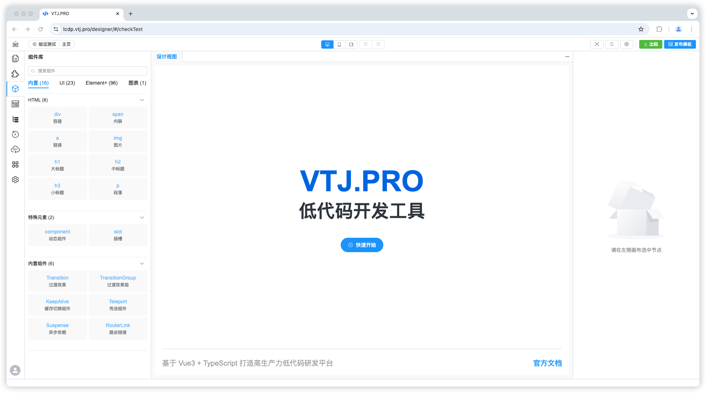
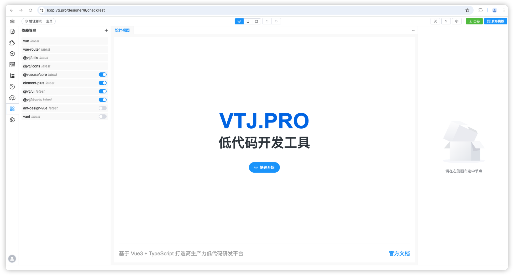
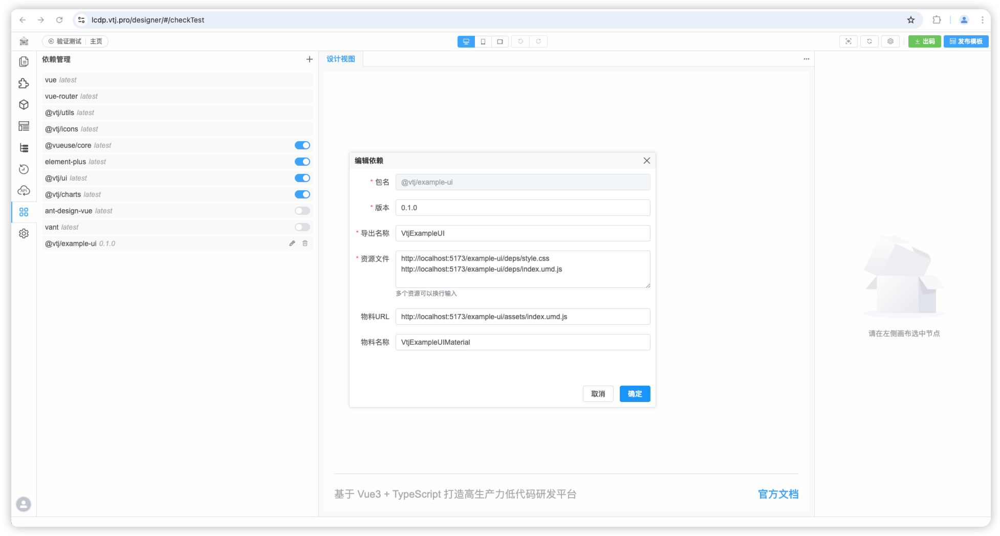

# VTJ低代码设计器入门系列（四）：物料和依赖管理

## 物料

物料是指设计器能识别的组件或类库。物料是低代码重要资源，如果设计器是厨师，物料就是菜的材料。

设计器可用的物料在组件库的面板中展示，VTJ内置了常见的第三方组件库和工具库，如：ElementPlus、AntDesignVue、Vant、ECharts、VueUse 等。

组件可以通过鼠标拖拽放置到画布中。

## 依赖管理

依赖管理就是对项目依赖的组件库、类库进行维护，类同 `package.json` 中的 `dependencies`。

同时，物料也是通过依赖管理进行维护。

内置的依赖包括：Vue、VueRouter、@vtj/utils、@vtj/icons、@vueuse/core、elemnet-plus、@vtj/ui、@vtj/charts、ant-design-vue、vant

其中 ant-design-vue 和 vant 默认是关闭的，如需使用，可手动打开，当打开依赖项，该依赖的可用的组件将出现在组件库的面板中。

### 新增依赖

当内置的依赖不能满足需求时，可自行新增您需要的依赖，对依赖的产物要求是 `IIFE` 或 `UMD` 格式。如依赖包含Vue组件，需要提供组件物料描述文件，同样是`IIFE` 或 `UMD` 格式。

上图是一个组件库的物料物料示例。关于如何编写组件的物料描述，请参考示例项目： https://gitee.com/newgateway/examples-vtj/tree/master/packages/ui

添加完成依赖后，在组件库面板就会显示物料的可用组件。

::: warning 注意
如何项目是需要本地打包的，需要在项目 package.json 中也加上该依赖项
::::
