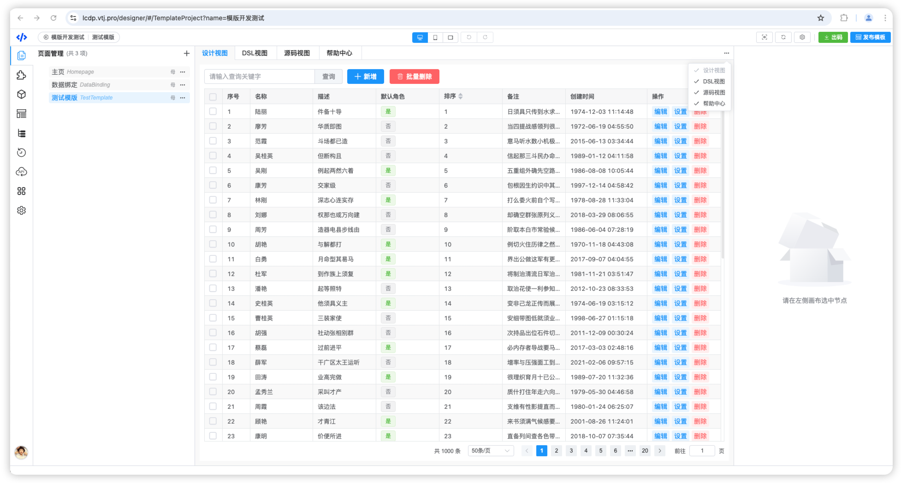
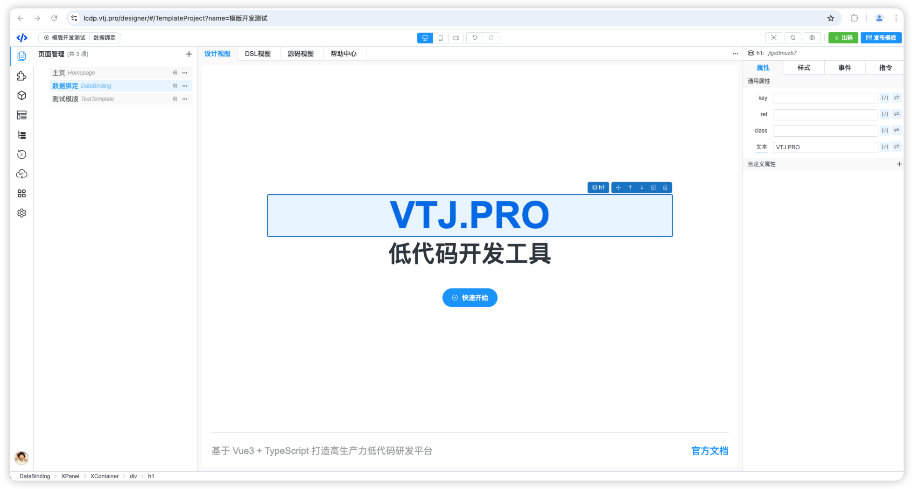
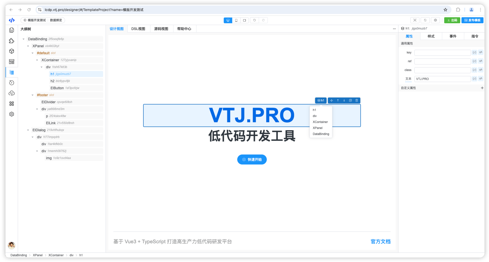
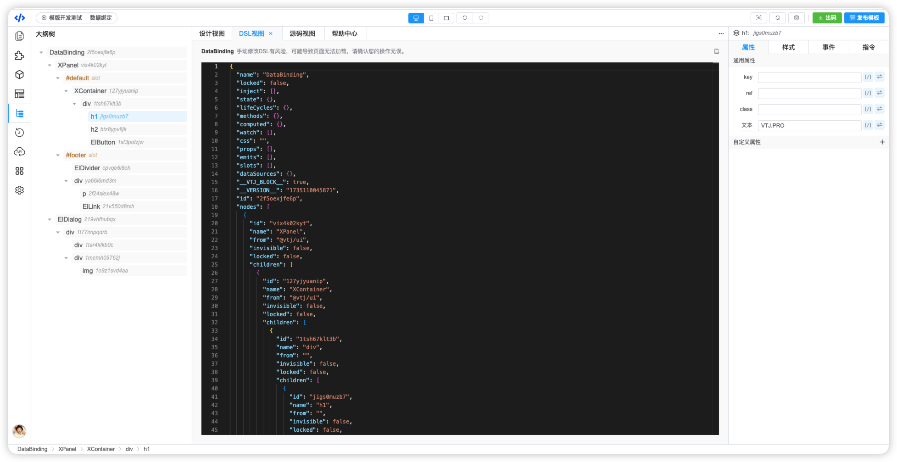
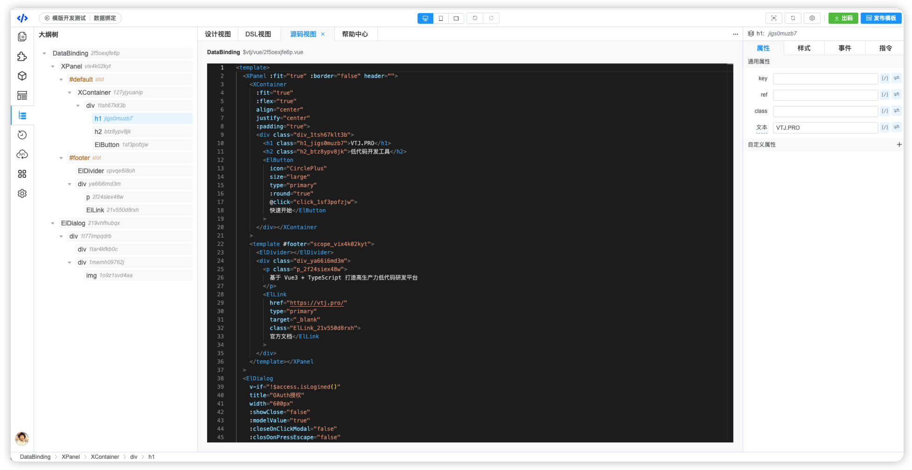
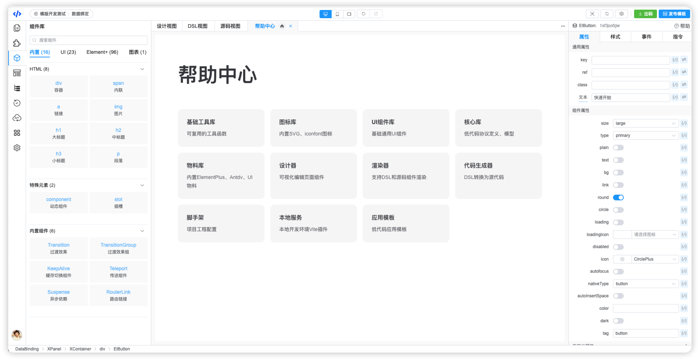
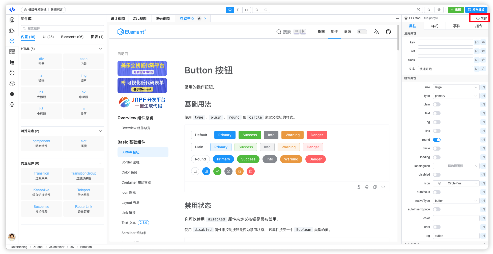
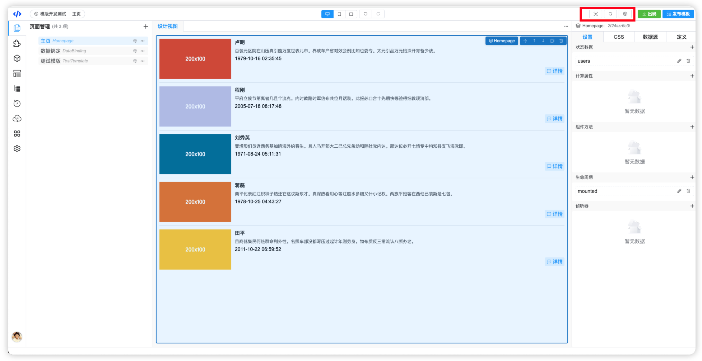
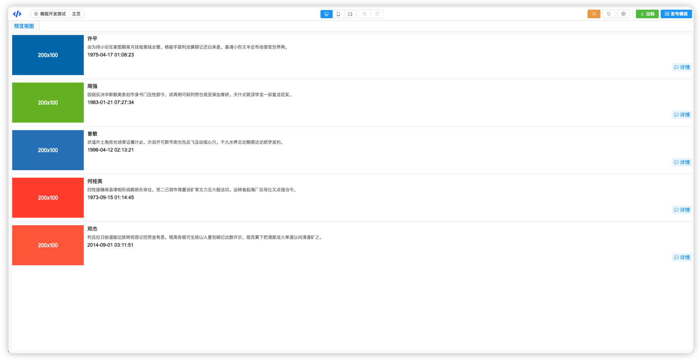

# VTJ低代码设计器入门系列（五）：工作区和画布操作

本章节介绍设计器的工作区各个相关模块和操作功能。

## 工作区

设计器工作区包含以下模块：设计视图、DSL视图、源码视图、帮助中心。 初始化知显示设计视图，其他模块可通过右侧的下拉按钮激活。

### 设计视图

低代码的可视化操作是在设计器视图中进行。

设计视图可打开页面或区块文件，在 [页面管理](03.md) 或`区块管理`模块点击项，即可在设计视图打开对应的文件。

鼠标移动进入设计视图，节点辅助线显示，表示该节点可设计，点击即进入该节点的配置状态，同时设计器右侧设置区面板激活，可以对该节点进行属性、样式、事件、指令等配置。 如果选择的节点是页面，即进入页面配置。

当选中节点时，节点辅助工具将显示，同时，在大纲中也会高亮该节点。

辅助工具从左到右依次是：节点层级、 拖拽移动、向前移动、向后移动、复制、删除

### DSL视图

DSL视图是展示当前正在编辑文件的DSL内容，是一个JSON格式数据，内容与设计视图是实时同步更新。可手动修改DSL，但有风险，可能导致页面无法加载。

### 源码视图

源码视图展示当前正在编辑文件生成的Vue文件源码，是一个Vue的单文件组件，内容与DSL视图实时同步更新，源码视图内容不能编辑。

### 帮助中心

帮助文档是VTJ相关的文档

当在设计视图选中节点时，节点的设置面板被激活，在属性设置区可以通过组件`帮助`的链接打开进入对应的组件使用文档。

## 操作工具

设计器顶部区域有与工作区相关的功能按钮：预览、刷新、页面设置

**预览：** 打开预览视图，预览当前编辑的页面。当预览视图已打开，再次点击`预览`按钮就是关闭预览视图

**刷新：** 刷新当前的设计视图或预览视图。当设置节点没有生效或，显示有异常，可能需要用到刷新，触发页面重新渲染。

**页面设置：** 打开页面设置面板，可以对页面配置 状态数据、计算属性、方法、生命周期、侦听器、CSS、数据源以及页面组件相关的定义。
