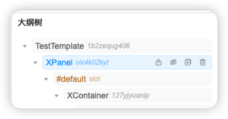
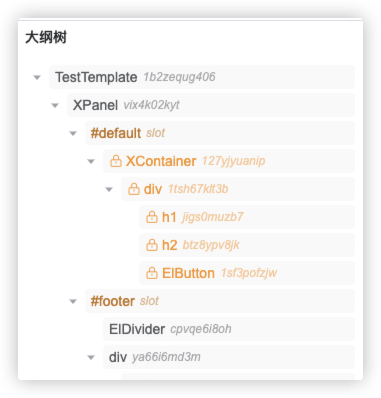
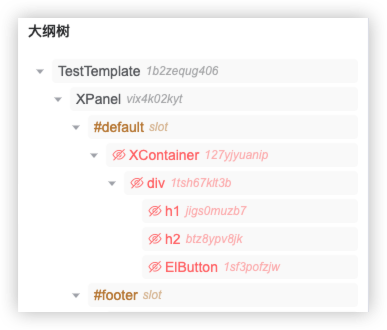

# VTJ低代码设计器入门系列（六）：节点大纲树

大纲树是以树结构展示页面或区块的节点层级关系，并提供拖拽更改位置、锁定、隐藏、复制、删除等辅助设计的功能。 它和设计器视图是实时联动的，当在设计视图不能完成的操作可以切换到大纲树处理。

## 节点功能

### 拖拽排序、更改层级

鼠标可拖拽节点进行排序，或更改层级关系。

### 选择节点

点击节点即可选中节点，与在设计视图点击节点选择功能一致，选择节点后，将打开设置面板，可以给节点设置属性、事件等配置。

### 锁定

锁定节点即不能对该节点保护，禁止做任何更改。当节点的配置已完成，为了防止错误更改了节点，可以使用锁定功能，避免错误操作。

### 隐藏

隐藏节点是在节点树中剔除该节点，与给组件加上指令 `v-if=false` 效果一致。当因css的层级关系不方便给组件配置属性时，可以临时隐藏节点辅助配置。

### 复制

在节点相邻位置克隆出一个节点，与设计视图的复制功能一致。

### 删除

删除该节点

## 总结

大纲树是对设计视图的一个补充，起到辅助设计作用。 如需要拖拽排序，在大纲树跟方便直观操作。
