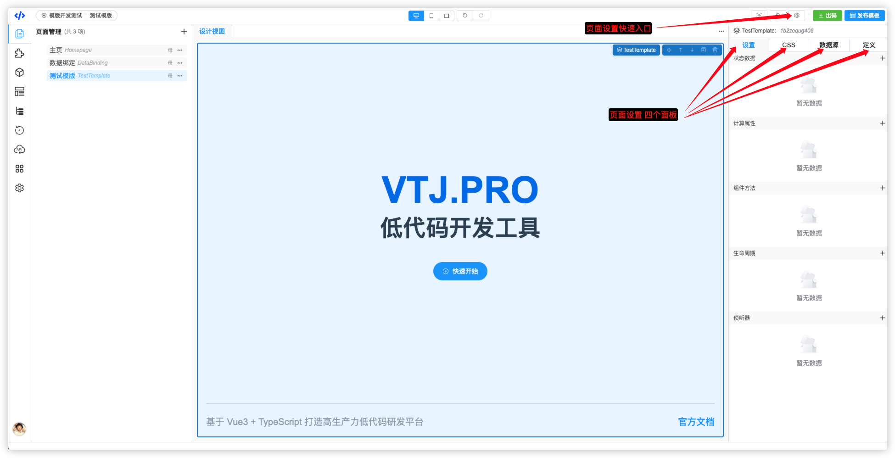
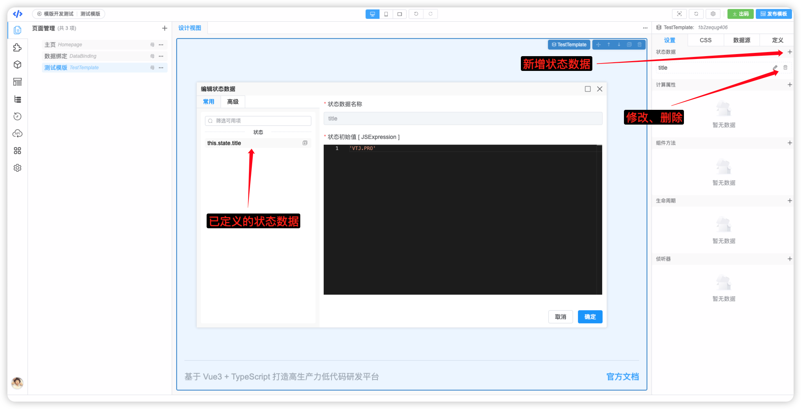
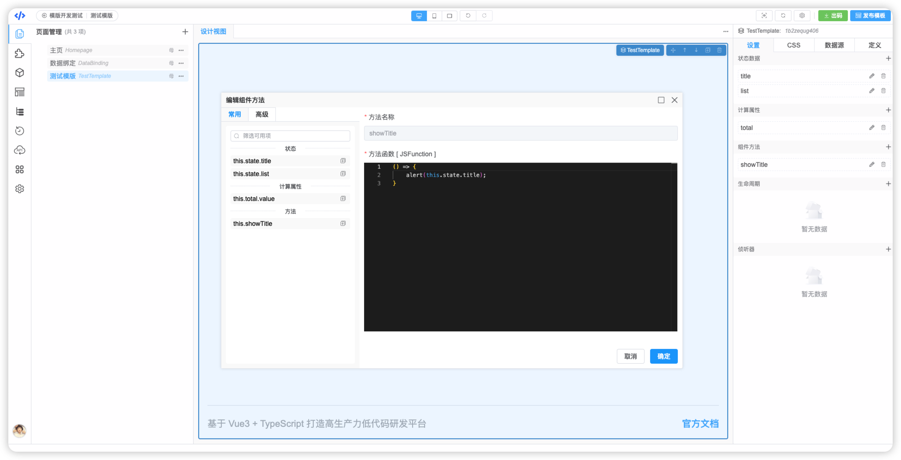
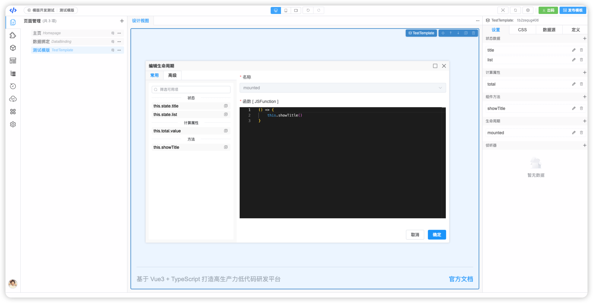
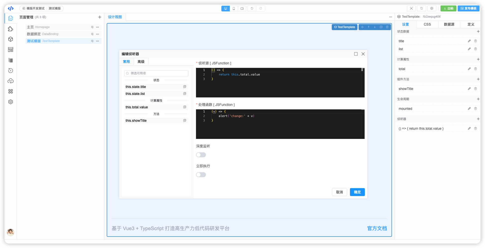
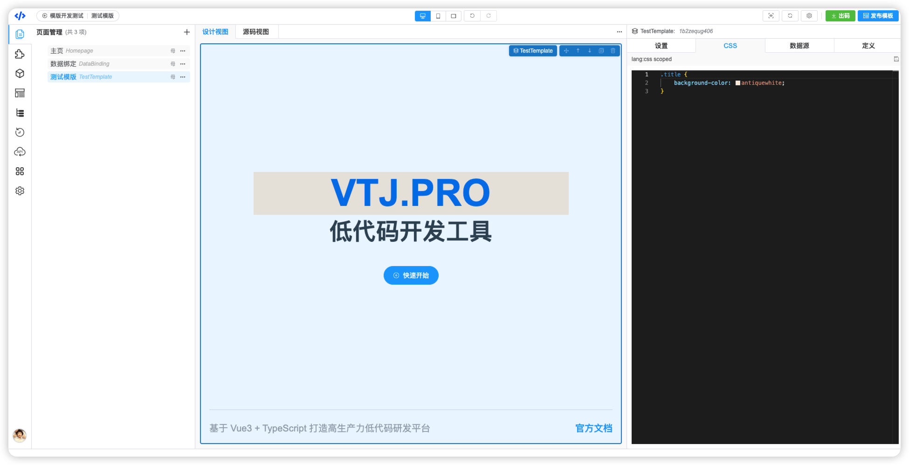
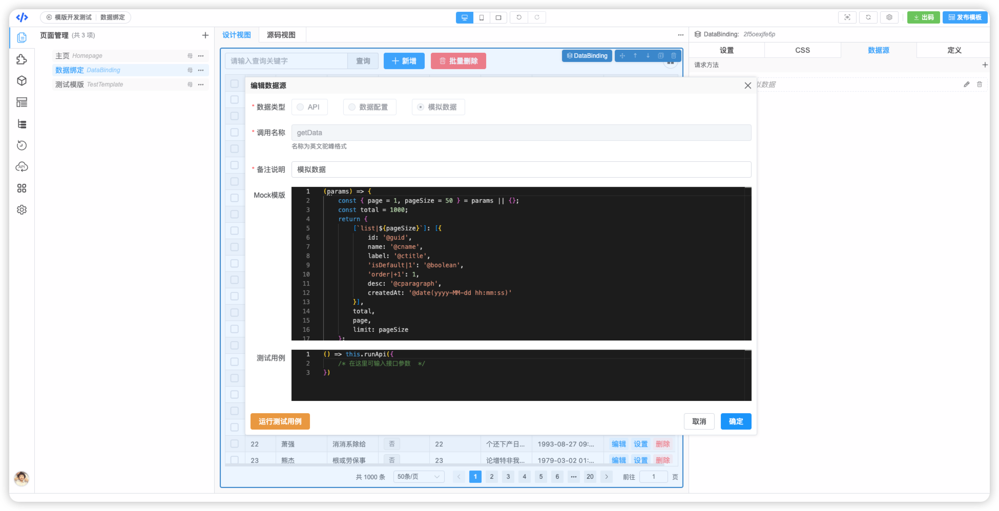
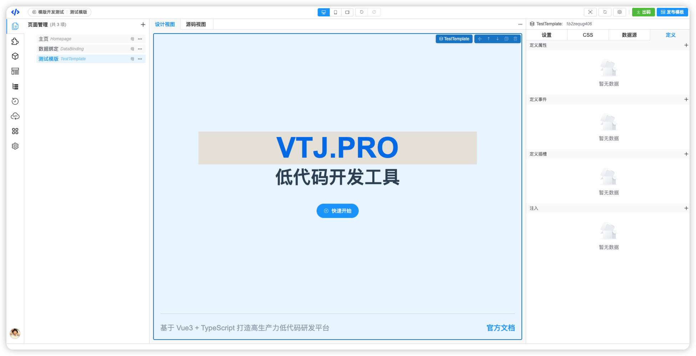

# VTJ低代码设计器入门系列（八）：页面设置

页面和区块本质是一个Vue单文件组件，页面设置就是给Vue的组件配置组件相关定义、逻辑和样式。 组件相关定义、逻辑是以Vue组件 options api 形式组装。

设计视图加载页面和区块后，可以通过鼠标点击画布的页面或页面设置快速入口按钮激活页面设置面板，页面设置分为四部分：设置、CSS、数据源、定义



## 设置面板

设置面板是定义Vue组件的状态数据(组件data)，计算属性、组件方法、生命周期以及侦听器(watch)。本质就是定义Vue组件的 options 参数, 组件其他的定义都在 `定义` 面板中。

### 状态数据

状态数据就是定义组件的内部变量，即组件的data，这些变量能与节点的属性、事件进行绑定。 定义的状态数据，可以通过 `this.state.`前缀调用。 定义状态数据制定初始值，如开始未知值，可以设置为 `null` 或 `undefined`

:::warning 注意
状态数据的表达式中不能使用 `this.` 关键字，`this.props`除外， 就是说必须是普通数据类型或 `this.props`的数据项
:::



### 计算属性

计算属性与Vue的概念一致，设计器的计算属性目前只支持 `get` 的定义。 计算属性函数内能够使用`this`关键字


### 组件方法

组件方法的设置方法与计算属性类似。也是vue的组件的方法。



### 生命周期

设置Vue组件的生命周期， 支持以下钩子函数：

```ts
// 组件生命周期
export const LIFE_CYCLES_LIST = [
  'beforeCreate',
  'created',
  'beforeMount',
  'mounted',
  'beforeUpdate',
  'updated',
  'beforeUnmount',
  'unmounted',
  'errorCaptured',
  'renderTracked',
  'renderTriggered',
  'activated',
  'deactivated'
];
```



### 侦听器

侦听器就是组件的watch配置，源必须是一个函数，需要有返回值。 其他配置与vue的watch api 一致。



## CSS 面板

CSS面板是设置组件的CSS代码，也就是Vue单文件组件的 `style` 代码块，只支持 css 语法，默认带上作用域。

```html
<style lang="css" scoped>
.title {
    background-color: antiquewhite;
}
<style>
```

等同



## 数据源 面板

定义数据源，会给组件增加一个异步方法，调用方法返回数据。数据源支持引用API和模拟数据。 关于数据源和API管理单独一个章节介绍。



## 定义 面板

在定义面板可以设置组件的 `defineProps`、`defineEmits`、`defineSlots` 和 `inject` 。 这些概念也Vue也是一致的。

在 `defineProps` 定义的属性参数，页面组件会自动从路由的 `query` 中获取传入到组件中。

定义了 `defineProps`、`defineEmits`、`defineSlots` 的区块组件，在设计器中可以推到出区块组件有哪些可设置的属性、事件和插槽。


