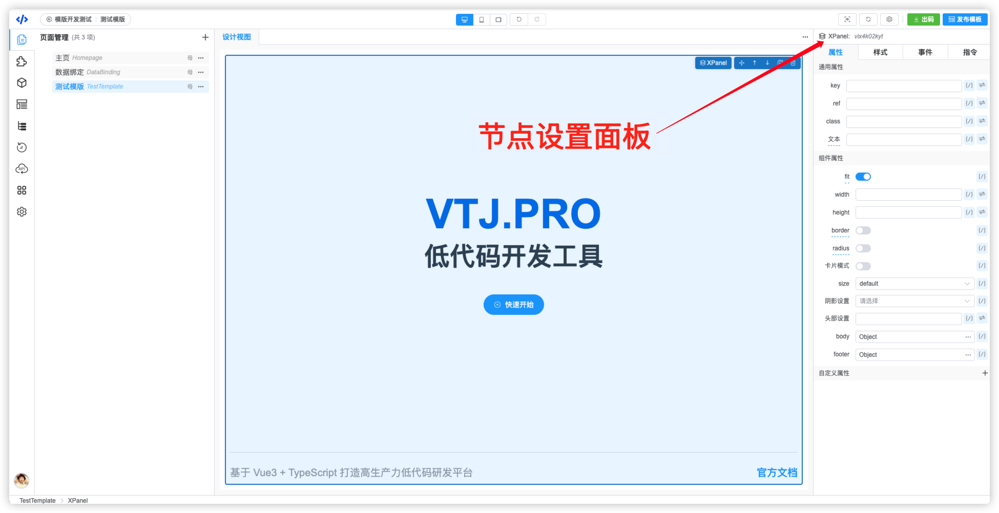
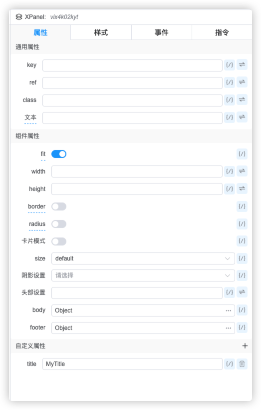
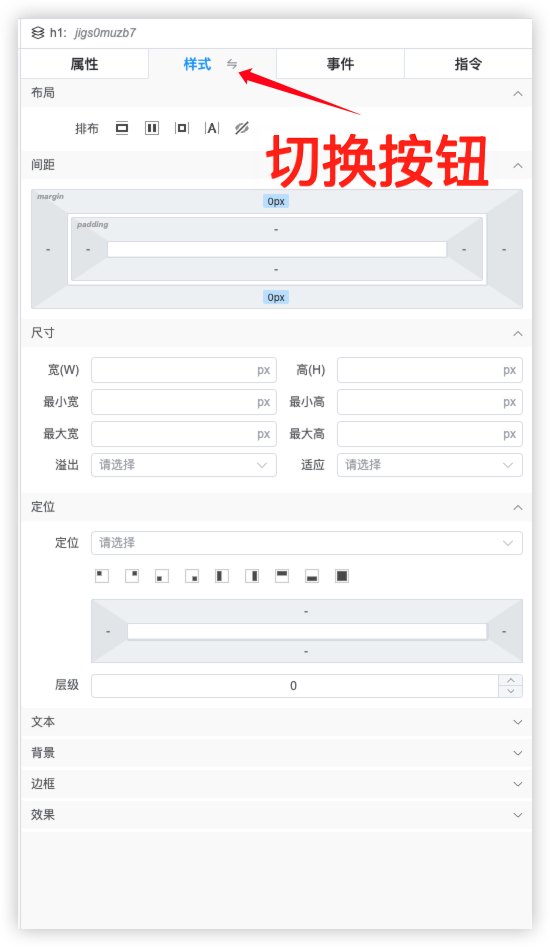
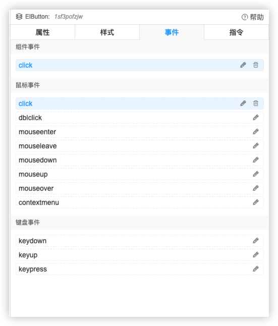
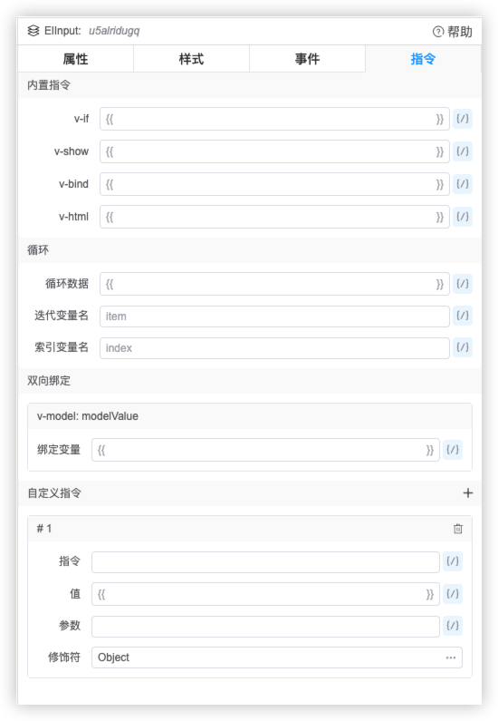

# VTJ低代码设计器入门系列（九）：节点设置

节点可以理解为Vue组件渲染后的实例。节点设置类似写代码的开发方法方式，给vue单文件组件中的模版代码块中的组件配置属性、事件等行为。

在 `设计视图` 或 `大纲树` 中选中节点，就会在设计器右侧激活节点设置面板。 节点设置包含四部分：属性、样式、事件、指令。

## 属性

节点属性设置有三个分类：

1. 通用属性： 任何节点都有的通用属性，如 key、ref、class，和一个特殊的`文本`，这个`文本`是指组件的子节点为文本内容。
   :::warning 注意
   如果设置了这个文本属性，将会清空节点的子节点
   :::

1. 组件属性：组件自己提供支持的属性，设计器是通过物料协议识别该组件能支持哪些属性。

1. 自定义属性：是指物料协议没有描述，但组件是支持的，例如原生的HTML属性等，都可以手动添加自定义属性。

## 样式

节点样式设置面板提供常见 `style` 可视化配置项，包括：布局、间距、尺寸、定位、文本、背景、边框、效果等。 当配置项无法满足需求也可以切换到JSON的模式，配置 `style`属性。

## 事件

节点事件支持 组件事件、鼠标事件、键盘事件的设置。 组件事件是指组件自身支持的事件，设计器是通过物料协议识别组件支持的事件。

当组件本身支持某些事件，但是协议没有描述出来，在事件面板中没有显示，可以到属性设置，添加自定义属性，属性名以 `on`为前缀的驼峰格式，也能绑定事件。

## 指令

指令设置面板提供组件的内置指令、数据循环、双向绑定的指令配置，也支持自定义的指令配置。支持的指令包括： v-if、v-show、v-bind、 v-html、v-for、v-model

