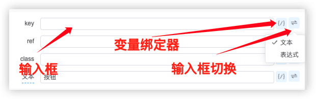
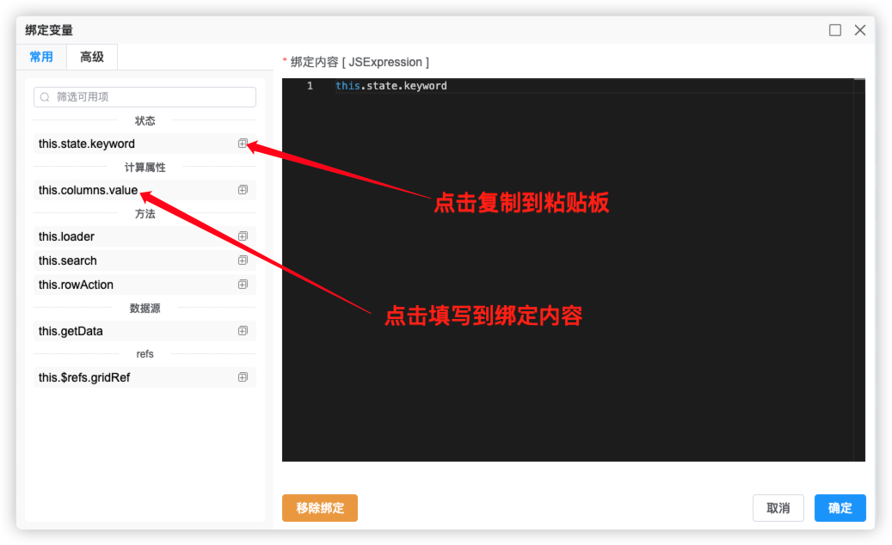
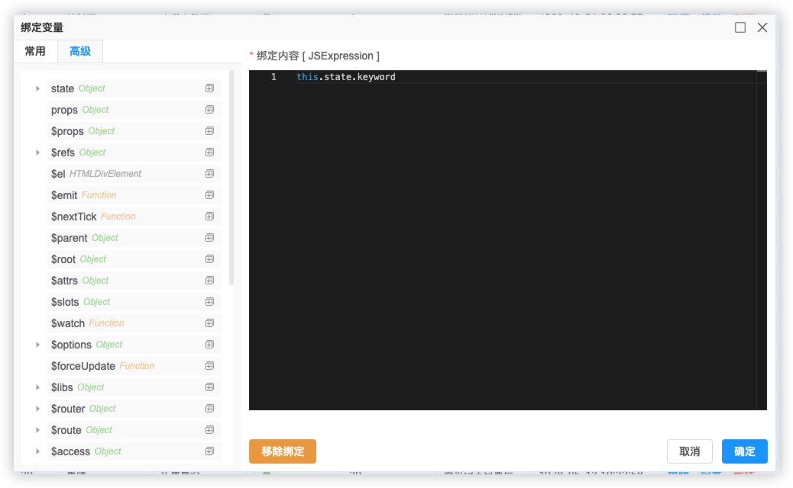
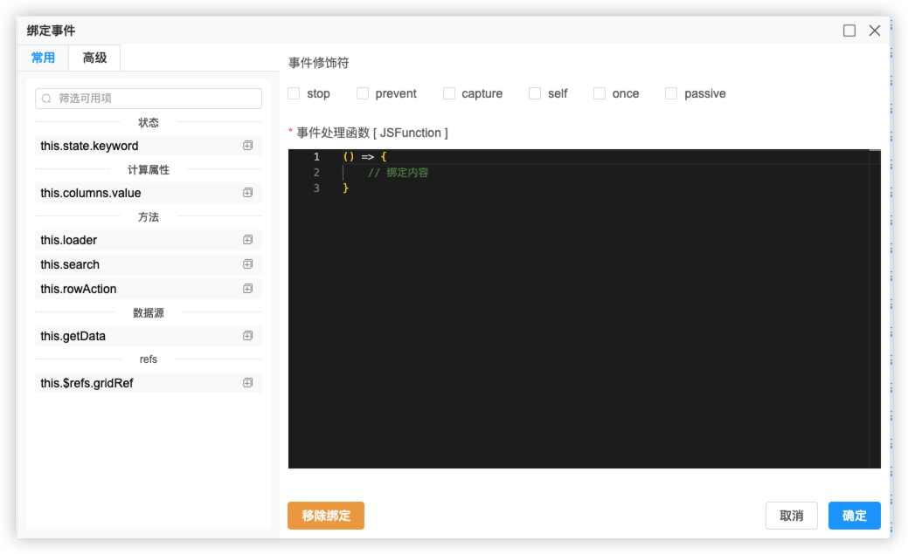

# VTJ低代码设计器入门系列（十）：设置器和绑定器

设置器和绑定器是VTJ低代码设计器的两个重要的工具。

## 设置器

设置器出现在属性设置面板，它通常包含三部分： 输入框、变量绑定器、输入框切换下拉菜单。

输入框是根据属性值的数据类型来匹配，默认是文本框。低代码物料协议描述了组件的属性使用设置器，目前引擎内置支持设置器包括：

- StringSetter
- BooleanSetter
- ExpressionSetter
- SelectSetter
- NumberSetter
- ColorSetter
- IconSetter
- ObjectSetter
- ArraySetter
- JsonSetter
- FunctionSetter
- RadioSetter
- TagSetter
- SizeSetter
- ImageSetter
- SectionSetter
- SliderSetter
- RangeSetter
- FileSetter
- FilesSetter

有的属性支持多种数据类型，可以通过设置器右侧的下拉菜单切换设置器。

## 绑定器

引擎有两种绑定器： 变量绑定器 和 事件绑定器。两者功能类似，不同的是， 变量绑定器 绑定的是 表达式， 事件 绑定器是绑定函数

### 变量绑定器

绑定器左侧有两个选项卡，常用 和 高级。

**常用** 是指在页面设置的内容，如状态、计算属性、方法、数据源、refs 以及可用的上下文变量。

**高级** 是指当前可用绑定的内容，即组件当前的实例能用到任何数据。

### 事件绑定器

事件绑定器的绑定内容是函数，同时提供事件修饰符设置。

:::info 注意
设置器使用了变量绑定后，输入变为不可输入状态。如需恢复可输入，需要在变量绑定器点击移除绑定按钮
:::
