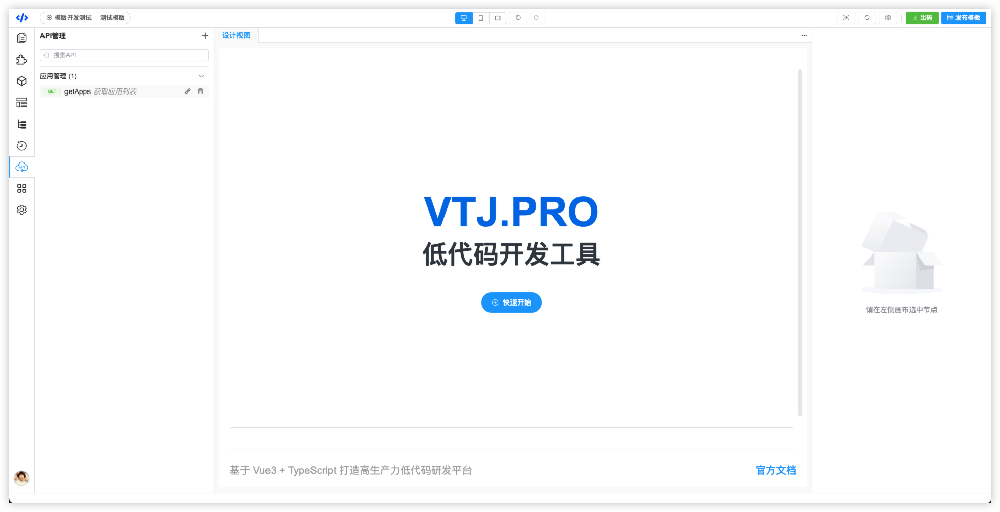
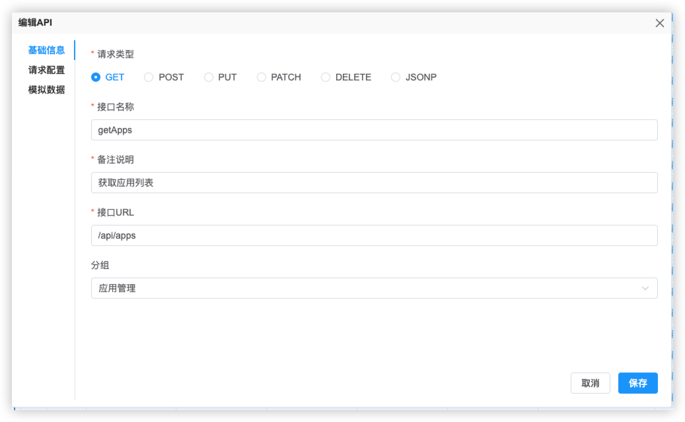
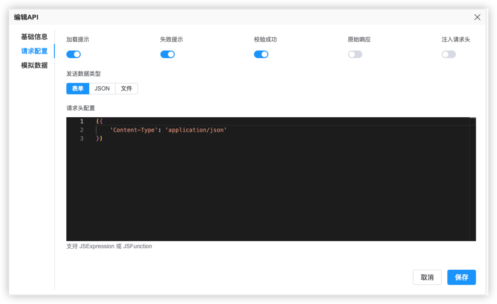
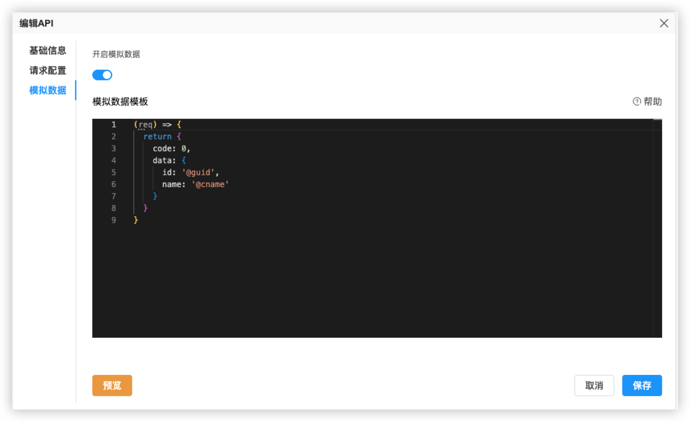
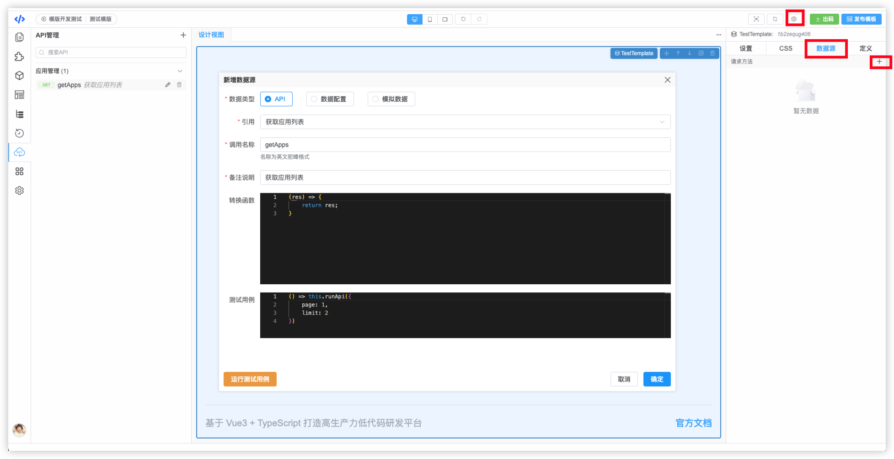
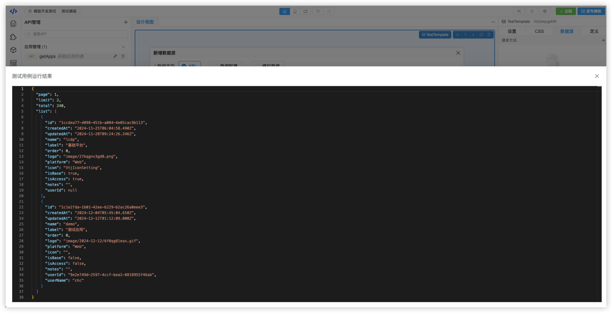
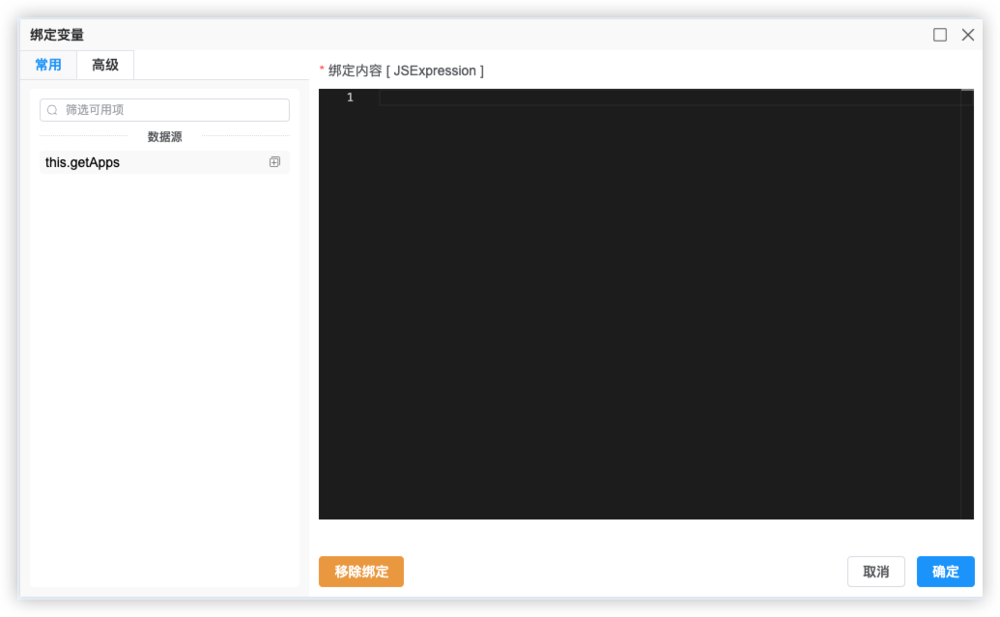

# VTJ低代码设计器入门系列（十一）：API管理和数据源

页面与后端交互通过API管理和数据源来完成。 API管理是对整个项目的共享的。 每个页面或区块有各自的数据源，数据源可引用API。

数据源本质是一个异步函数，可接收参数通过API发送给后端，响应结果是Promise。

## API 管理

API管理面板在设计器左侧菜单。 在API管理面板可以对API进行增、删、改、查操作。

一个API设置分为三部分： 基础信息、请求配置、模拟数据。 通常只需要设置基础信息即可。

### 基础信息

API基础信息可配置 请求类型、接口调用名称、说明、接口URL、分组。

分组是用来归类API，方便查找。

### 请求配置

在请求配置项目，可对API请求做个性化配置，如：显示loading、提示失败信息、自动校验请求是否成功、发送数据类型、以及请求头等配置。

发送请求使用的是经过封装的 `axios` ，在依赖包 `@vtj/utils` 中的 `request`

### 模拟数据

如需给接口响应模拟数据，可把开启模拟数据的开关打开，编写模拟数据模版。

模拟数据采用 `mockjs`实现， 文档： https://vtj.pro/help/mock.html

## 数据源

页面或区块需要调用API，需要到页面设置中的数据源面板新建数据源，引用API。

在新建数据源时，选择引用的API，同时可以更改配置调用名称，增加数据转换函数，并且可测试预览接口响应数据。

接口测试预览

新增数据源，组件就会生成一个异步函数，在需要的时候可执行函数，同时在绑定器的常用选择项也会显示可用的数据源函数。

