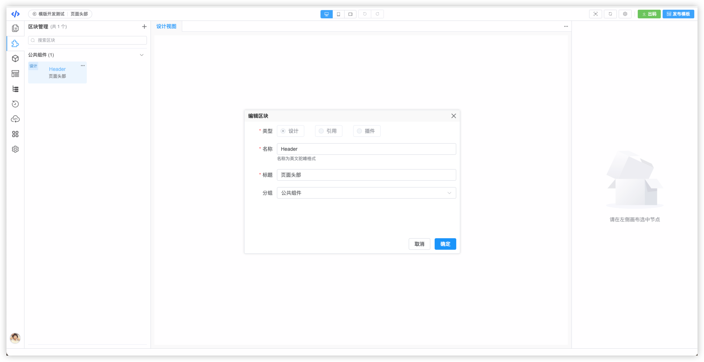

# VTJ低代码设计器入门系列（十二）：区块管理

区块和页面本质都是Vue的单文件组件，区别的是页面带有路由信息，区块没有。区块就像公共组件一样，能被页面或其他区块引用。因此，区块管理中的区块是可以拖拽放置到页面中的。 在设计器的区块可以理解为用低代码制作的公共组件。

区块支持三种类型： 设计、引用、插件。

- `设计`：指用设计器制作的区块。
- `引用`：设计器导出的JSON文件
- `插件`：使用源码开发好的的组件，经过编译打包umd格式。即远程组件

区块与页面在设计器的行为几乎是一致的。复杂的页面可以拆分为多个区块制作，然后组装成页面。

区块管理面板，可以对区块进行增、删、查、改，以及复制副本。
