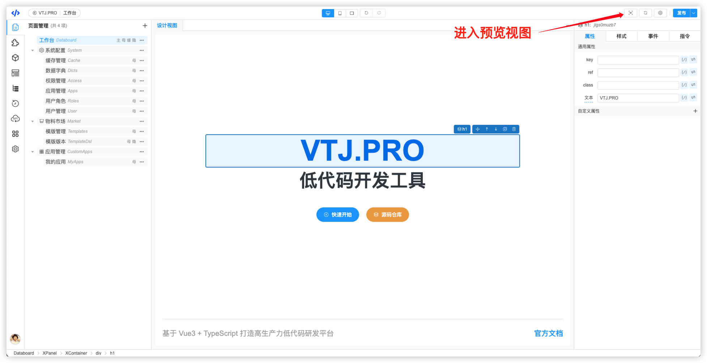
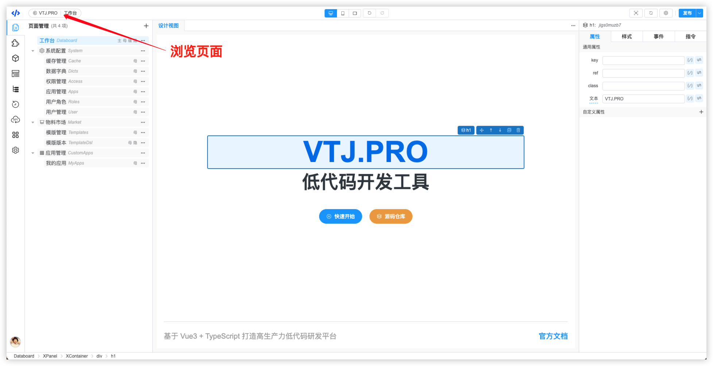
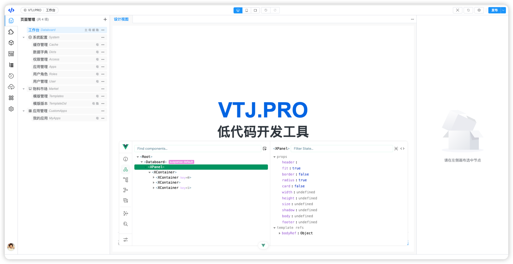
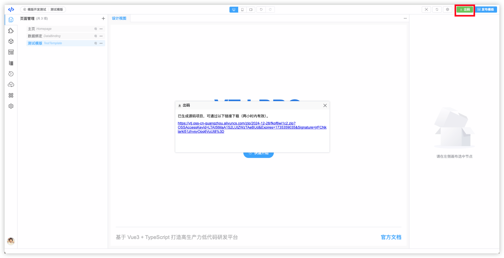
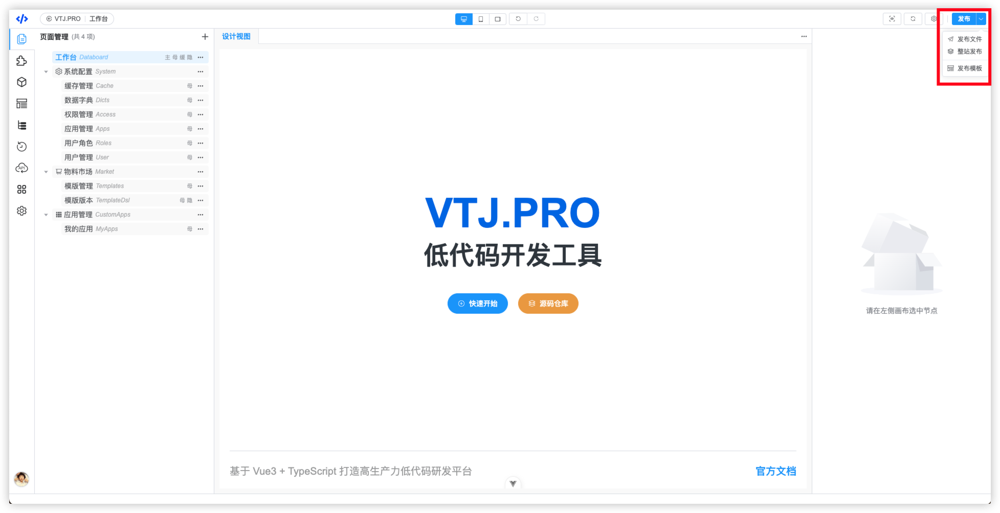
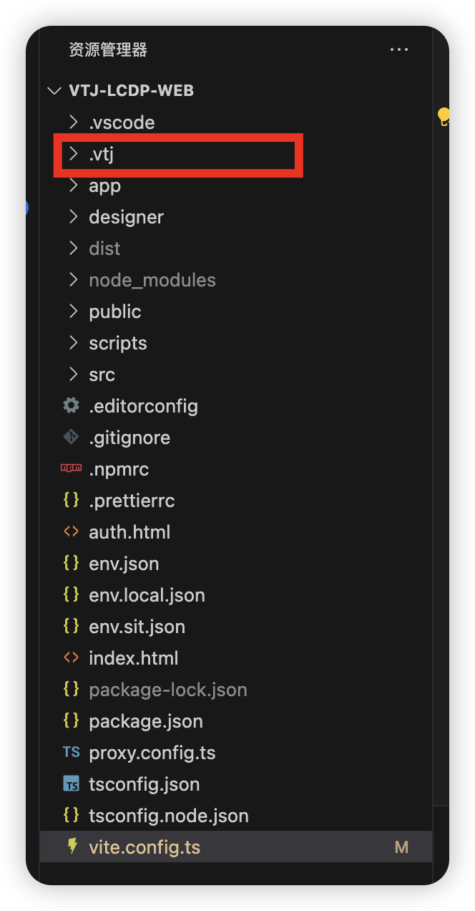

# VTJ低代码设计器入门系列（十三）：预览、调试和发布

低代码设计器有在线和离线两个版本。

1. 在线访问：https://lcdp.vtj.pro/

1. 离线通过脚手架下载，推荐使用离线版本，性能更高，功能更强。

```
npm create vtj@latest -- -t app
```

## 预览

两个版本都可通过预览按钮进入页面的预览视图。预览视图是运行时DSL渲染。



设计器左上级的页面名称可以浏览页面最终效果。在线版本是DSL运行时渲染，离线版本是发布的源码渲染。



## 调试

离线版本支持`vue-devtools`调试，默认该功能关闭，需要手动开启。

**开启方式**

项目工程 `vite.config.ts` 文件的 devtools 开关打开，如：

```ts
import { createViteConfig } from '@vtj/cli';
import { createDevTools } from '@vtj/local';
import proxy from './proxy.config';
export default createViteConfig({
  proxy,
  devtools: true, // 开发调试工具开关
  plugins: [createDevTools({})]
});
```

设计器支持打开vue-devtools



## 发布

**在线版本**

在线版本支持出码功能，把设计器中的项目导出源码工程，项目工程下载后可自行编译打包和部署。



**离线版本**

离线版本支持直接发布vue源码文件到项目工程，开发更方便快捷， 支持当前页面发布 和 整站发布。



发布后的文件存放在项目工程根目录的`.vtj`文件夹。



:::warning 注意
离线版本的 .vtj 文件是存放设计器数据和产物的，不能删除。应和工程源码提交git做版本管理。
:::

**项目工程命令**

- 安装依赖 `npm run setup`
- 启动开发环境 `npm run dev`
- 编译 `npm run build`
- 预览打包结果 `npm run preview`
- 清除项目依赖和产物 `npm run clean`
