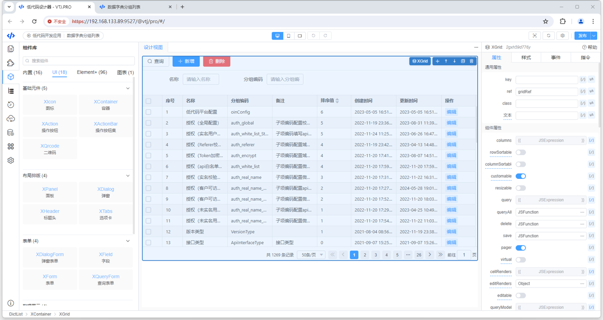

# 简介

##

VTJ.PRO 是一个基于Vue3 + TypeScript的低代码开发工具平台，它致力于提供高生产力的低代码研发解决方案。以下是对VTJ.PRO的详细介绍：

### 平台特点

**技术基础：** VTJ.PRO采用Vue3和TypeScript作为其核心技术栈，确保了平台的现代性和高效性。

**低代码开发：** 平台内置了设计器引擎、渲染器和代码生成器，支持用户通过可视化方式设计页面组件，并自动生成源代码，大大降低了开发门槛和提高了开发效率。

**丰富的工具库：** VTJ.PRO提供了可复用的工具函数、图标库（包括SVG、iconfont图标）以及基础通用UI组件等，方便用户快速构建应用界面。

**灵活的物料库：** 平台内置了ElementPlus、Antdv等UI物料，用户可以根据项目需求选择合适的物料进行开发。

### 功能组件

**设计器：** 支持可视化编辑页面组件，用户可以通过拖拽等方式轻松设计页面布局。

**渲染器：** 支持DSL（Domain Specific Language，领域特定语言）和源码组件渲染，确保设计的页面能够准确呈现。

**代码生成器：** 能够将DSL转换为源代码，自动生成可执行的代码文件，减少手动编码的工作量。

### 应用场景

VTJ.PRO适用于各种需要快速开发、迭代的场景，如企业级应用开发、中后台系统建设、Web前端项目工程等。通过VTJ.PRO，开发者可以更加专注于业务逻辑的实现，而不是繁琐的页面设计和编码工作。

### 使用优势

**提高开发效率：** 通过低代码开发方式，可以显著缩短开发周期，提高开发效率。

**降低开发成本：** 减少了对专业开发人员的依赖，降低了人力成本和时间成本。

**增强应用灵活性：** 平台提供的丰富工具和物料库，使得应用界面和功能可以更加灵活地定制和扩展。

### 结语

VTJ.PRO作为一款基于Vue3 + TypeScript的低代码开发工具平台，凭借其先进的技术基础、丰富的功能组件和灵活的应用场景，正在成为越来越多企业和开发者的首选。如果你正在寻找一款高效、易用的低代码开发工具，VTJ.PRO无疑是一个值得考虑的选择。
