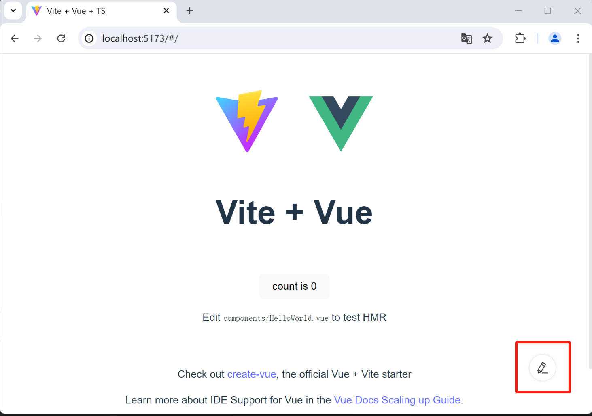

# 项目集成

通过脚手架可以方便快捷创建项目，但仅适用于新的项目，本章节介绍在现有的项目如何集成低代码设计器。

## 前提

:::warning 集成 VTJ 低代码的前提条件
前端工程是基于 Vite + TypeScript 的 Vue3 项目
:::

`Vue2` 或 是采用 `Webpack` 的非`ts`项目官方暂不提供支持。

## 集成步骤

现有项目需要使用VTJ辅助开发，按以下步骤集成：

### 一、添加依赖

项目工程需安装以下依赖

安装 `@vtj/cli` `@vtj/pro` 到 `devDependencies`

```sh
npm install @vtj/cli @vtj/pro --save-dev
```

安装 `@vtj/web` 到 `dependencies`

```sh
npm install @vtj/web --save
```

### 二、添加插件

项目根目录下的 `vite.config.ts` 引入 VTJ 的开发工具插件

```js
import { defineConfig } from 'vite';
import vue from '@vitejs/plugin-vue';

// 导入vite插件
import { createDevTools } from '@vtj/pro/vite';

export default defineConfig({
  plugins: [
    vue(),
    // 添加插件
    createDevTools()
  ]
});
```

### 三、改造入口程序

要使低代码设计器生成的产物能在项目中运行，需要对项目的入口程序 `main.ts` 进行改造。

以下是参考示例，实际需要按项目情况进行调整。

```js
import { createApp } from 'vue';
// 1、引入 VTJ 相关功能
import { createProvider, LocalService, createModules } from '@vtj/web';
// 2、引用组件样式
import '@vtj/web/src/index.scss';

import './style.css';
import App from './App.vue';
import router from './router';

const app = createApp(App);

// 3、实例化低代码服务类
// 采用本地开发的服务，如需要部署在生产环境的，需要自行实现一个远程Service
const service = new LocalService();

// 4、创建低代码提供者实例
const { provider, onReady } = createProvider({
  nodeEnv: process.env.NODE_ENV as 'development' | 'production',
  modules: createModules(),
  service,
  router
});

// 5、低代码提供者初始化完成后注册在根应用注册 路由 和 provider
onReady(async () => {
  app.use(router);
  app.use(provider);
  app.mount('#app');
});

```

要点：

- 从 `@vtj/web` 依赖包引用 `createProvider`, `LocalService`, `createModules`
- 引入组件库样式 `@vtj/web/src/index.scss`
- 实例化服务类
- 用 `createProvider` 创建低代码提供者实例
- 当初始化完成时，注册router 和 provider

### 四、添加异步依赖

低代码页面组件是异步加载的，因此 `App.vue` 需要添加异步依赖`Suspense`, 如果您的项目已增加了 `Suspense` 可以跳过该步骤。

可以按以下方式改造 `App.vue`

```html
<template>
  <Suspense>
    <router-view></router-view>
  </Suspense>
</template>
<script lang="ts" setup>
  import { Suspense } from 'vue';
</script>
```

### 五、tsconfig.json

ts 忽略 .vtj 文件夹校验，在 `tsconfig.json` 文件增加

```ts
{
  "exclude": [".vtj"]
}
```

## 配置项

### 开启项目二级目录

如项目配置 `vite.config.ts` 的 `base` 参数，设置项目路径，需要同时配置 `createDevTools` 的 `staticBase` 参数选项

```js
import { defineConfig } from 'vite';
import vue from '@vitejs/plugin-vue';
import { createDevTools } from '@vtj/pro/vite';
const base = '/sub/';
export default defineConfig({
  base,
  plugins: [
    vue(),
    // 设置staticBase
    createDevTools({
      staticBase: base
    })
  ]
});
```

### 路由模式 History

如项目的路由模式是 `createWebHistory`, 在 `createProvider` 创建提供者实例时需要设置 物料的路径 basePath 如：

```js
const { provider, onReady } = createProvider({
  // 设置物料路径
  materialPath: '/',
  nodeEnv: process.env.NODE_ENV as 'development' | 'production',
  modules: createModules(),
  service,
  router
});
```

内置物料的文件存储在本地工程，位置：`/node_modules/@vtj/materials/dist/`

## 设计器入口

项目启动后，在页面右下角会出现可以打开当前页面的设计器。


