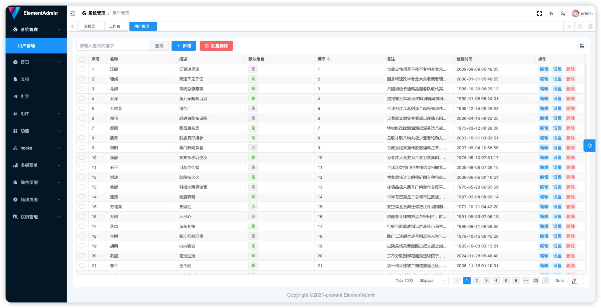

# vue-element-plus-admin

vue-element-plus-admin 是一个基于 element-plus 免费开源的中后台模版。使用了最新的vue3，vite，TypeScript等主流技术开发，开箱即用的中后台前端解决方案，可以用来作为项目的启动模版，也可用于学习参考。并且时刻关注着最新技术动向，尽可能的第一时间更新。

## 介绍

VTJ内置了集成方法, 集成示例代码：https://gitee.com/newgateway/vue-element-plus-admin

分支：dev-vtj

## 集成步骤

### 一、添加依赖

```sh
npm i @vtj/cli @vtj/pro -D
```

```sh
npm i @vtj/web -S
```

### 二、package.json

在 `package.json` 文件添加vtj描述信息

```json
{
  "vtj": {
    "id": "vue-element-plus-admin",
    "name": "ElementAdmin"
  }
}
```

### 三、vite.config.ts

在 `vite.config.ts` 文件引入vtj开发插件

```ts
import { createDevTools } from '@vtj/pro/vite';

export default {
  plugins: [createDevTools()]
};
```

### 四、tsconfig.json

在 `tsconfig.json` 添加 exclude .vtj 目录

```json
{
  "exclude": ["dist", "node_modules", ".vtj"]
}
```

### 五、.gitignore

添加排除 .vtj/histories

```
node_modules
.DS_Store
dist
dist-ssr
*.local
/dist*
*-lock.*
pnpm-debug
stats.html
.idea
.vtj/histories
```

### 五、src/main.ts

程序入口文件改造

```ts
// 新增以下引用
import { vtj } from '../package.json';
import { setupElementAdmin } from '@vtj/web';
import { IconsPlugin } from '@vtj/icons';
import '@vtj/web/src/index.scss';

// 改造setupAll函数
const setupAll = async () => {
  const app = createApp(App);
  await setupI18n(app);
  setupStore(app);
  setupGlobCom(app);
  setupElementPlus(app);
  setupRouter(app);
  setupPermission(app);
  //注册图标
  app.use(IconsPlugin);
  // 初始化vtj
  setupElementAdmin({
    id: vtj.id,
    app,
    ready: () => {
      app.mount('#app');
    }
  });
};
```

### 六、src/router/index.ts

改造静态路由文件

```ts
// 引用
import { vtj } from '../../package.json';
import { setupElementAdminRoutes } from '@vtj/web';

// 改造 setupRouter
export const setupRouter = async (app: App<Element>) => {
  // 初始化路由
  await setupElementAdminRoutes({
    id: vtj.id,
    router,
    routes: constantRouterMap,
    layout: Layout
  });
  app.use(router);
};
```

## 总结

经过上述改造，项目在开发环境就内置了VTJ设计器。可以通过设计器完成页面的开发。


