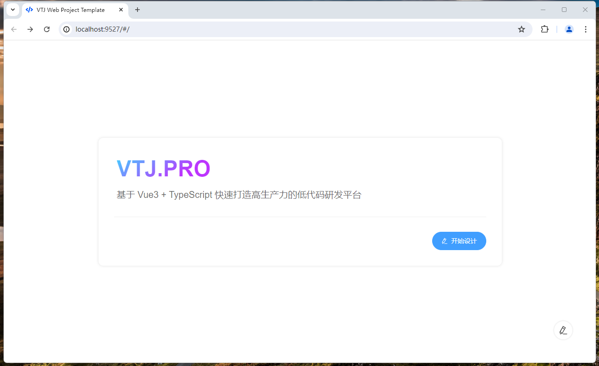

# 快速上手

## 创建一个 VTJ 应用

VTJ.PRO 提供了开箱即用的项目脚手架，可以快速创建基于VTJ低代码的开发项目工程，并默认最佳实践的配置，非常适用新项目开发。

:::tip 前提条件

- 熟悉命令行
- 已安装 v20 或更高版本的 Node.js

:::

### 使用脚手架创建项目

打开终端工具输入命令运行

```sh
npm create vtj@latest -- -t app
```

如`npm`访问不了，可以尝试使用镜像：

```sh
npm create vtj@latest --registry=https://registry.npmmirror.com -- -t app
```

项目创建完成后进入，按提示进入目录 安装依赖 和 启动开发环境

```sh
npm run setup && npm run dev
```

看到以下页面，项目已正常运行，你可以开始使用设计器以低代码的方式开发应用了。



:::info 使用VTJ提供的项目脚手架，可快速创建开发项目工程。 命令：

1. Web应用(PC端)

   ```sh
   npm create vtj@latest --registry=https://registry.npmmirror.com -- -t app
   ```

1. H5应用(移动端)

   ```sh
   npm create vtj@latest --registry=https://registry.npmmirror.com -- -t h5
   ```

   :::

### 项目工程

项目工程配置及说明请参考 [项目工程模板章节](./base/project-template.md)

项目工程示例代码：[https://gitee.com/newgateway/examples-vtj/tree/master/packages/app](https://gitee.com/newgateway/examples-vtj/tree/master/packages/app)

### 设计器

低代码设计器的功能及使用说明请参考 [设计器使用手册](./base/designer.md)
